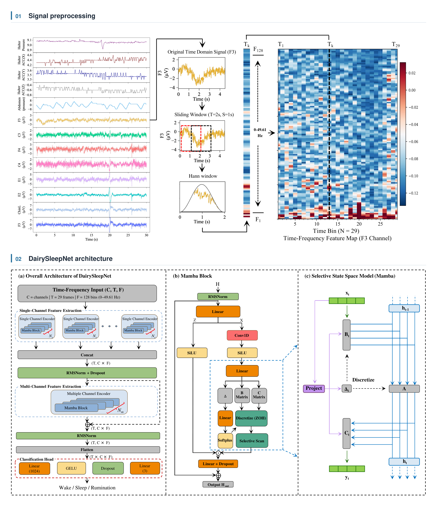

# DairySleepNet

DairySleepNet classifies **Wake, Sleep and Rumination** in dairy cows using a
two-stage Mamba-based model. Independent channel encoders process 30-second
time-frequency representations, followed by a multichannel fusion encoder and a
three-class classifier.

[](Figure/DairySleepNet_overview.png)

*Signal preprocessing (top) and DairySleepNet architecture (bottom), including
the Mamba block and selective state-space model. Click the image to view full size.*

This repository accompanies *Deep learning-based classification of wakefulness,
sleep, and rumination states in dairy cows from polysomnography and RumiWatch
data*, by Chuanyi Guo, Emma Ternman, Xinjie Zhao, Kai Liu and Mutian Niu,
Journal of Dairy Science.
[Paper DOI](https://doi.org/10.3168/jds.2026-28809) ·
[Paper PDF](Figure/1-s2.0-S0022030226032479-main.pdf).

## Modalities and labels

| Command-line name | Input | Channels |
| --- | --- | --- |
| `PSG` | Polysomnography | Abdomen, F3, C3, F4, C4, E1, E2, ChinL, ChinR |
| `ACC` | RumiWatch signals (RWS in the paper) | Pressure, Move_X, Move_Y, Move_Z |
| `PSG_ACC` | PSG and RumiWatch combined | The nine PSG channels followed by the four RumiWatch channels |

The `ACC` setting includes pressure as well as triaxial acceleration.
`PSG+ACC`, `PGS`, `PGS_ACC`, `RWS` and `PSG_RWS` are accepted aliases.
Prepared labels are `0 = Wake`, `1 = Sleep`, `2 = Rumination`.
Here, **R means Rumination**, following the study's annotation scheme.

## Installation

Create a conda environment with Python 3.10 and CUDA-enabled PyTorch 2.5.1.
Run these commands from the repository root on a machine with an NVIDIA GPU:

```bash
conda create -n dairysleepnet python=3.10 pip -y
conda activate dairysleepnet
conda install pytorch==2.5.1 pytorch-cuda=12.1 -c pytorch -c nvidia -y
python -m pip install -r requirements.txt
```

The CUDA package selection follows the
[PyTorch installation instructions](https://pytorch.org/get-started/previous-versions/#v251).
Activate the environment with `conda activate dairysleepnet` before preprocessing,
training or evaluation. The selective state-space scan is implemented in PyTorch;
`mamba-ssm` and custom CUDA extensions are not required.

## Data preparation

The repository includes a small set of real signal excerpts in
[demo_data/aligned](demo_data/aligned), with their labels, to illustrate the input
format. The full research dataset and trained weights are not included.
The included reference metrics contain aggregate evaluation results.

### Example recordings

The examples contain seven Cow IDs, each with nine 30-second epochs: three Wake,
three Sleep and three Rumination epochs. Across all examples, there are 63 epochs
and 31.5 minutes of signal excerpts, occupying approximately 5 MB. Each Cow has:

| File | Contents |
| --- | --- |
| `Cow1.edf` | Nine PSG channels sampled at 100 Hz |
| `Cow1_ACC.edf` | Pressure and three acceleration channels sampled at 100 Hz |
| `Cow1.txt` | Nine numeric labels, one per 30-second epoch |

The signal excerpts were selected from the prepared research recordings and
exported as EDF files with generic Cow identifiers. The selected epochs are not
consecutive; the resulting files demonstrate the data structure rather than a
continuous behavioral recording. See [the example data description](demo_data/README.md)
for selection details and label definitions. These examples cannot reproduce the
paper's performance estimates.

Prepare the included examples with:

```bash
python dataset_prepare_modality.py --modality PSG_ACC \
  --input-dir demo_data/aligned --data-root data/example
python run_prepare_tf_modality.py --modality PSG_ACC --data-root data/example
```

Use `--data-root data/example` when training on these prepared examples, and
replace `PSG_ACC` with `PSG` or `ACC` to prepare another modality.

### Your own recordings

Provide EDF recordings already aligned with their epoch labels, using generic
subject identifiers:

```text
data/aligned/
  Cow1.edf           # PSG, required for PSG and PSG_ACC
  Cow1_ACC.edf       # RumiWatch, required for ACC and PSG_ACC
  Cow1.txt           # one numeric label per 30-second epoch
  Cow2.edf
  Cow2_ACC.edf
  Cow2.txt
  ...
  Cow7.txt
```

For a given cow, both EDFs and the label sequence must start at the same epoch
boundary. Timestamp synchronization and device-specific conversion into aligned
EDFs are prerequisites. Channel names must match the table above. The pipeline
resamples to 100 Hz, retains complete 30-second epochs shared by the inputs and
labels, and removes epochs labeled `-1`.

By default, numeric input labels follow the study's five-code export:
`0 → Wake`, `1/2/3 → Sleep`, `4 → Rumination`, `-1 → missing`.
If the input is already encoded as `0/1/2`, pass `--label-format three`.
This option is essential: label `2` has a different meaning in the two formats.
Missing channels cause an error by default. `--allow-missing-channels` explicitly
enables the original zero-fill behavior; an entirely absent modality still fails.

```bash
python dataset_prepare_modality.py --modality PSG_ACC \
  --input-dir data/aligned --data-root data
python run_prepare_tf_modality.py --modality PSG_ACC --data-root data
```

Repeat these commands with `PSG` or `ACC` for the other modalities. Outputs are
stored separately under `data/raw/<modality>/` and `data/tf/<modality>/`.
Preprocessing refuses to replace an existing prepared dataset; use a fresh
`--data-root` when changing inputs.

The STFT follows the experiment script: a 2-second Hann window, 1-second hop,
256-point FFT, the first 128 real-FFT bins (DC included, Nyquist excluded), and
`log1p` magnitude. Each epoch produces `(channels, 29, 128)` features.
Each channel is standardized with one mean and standard deviation over **all
prepared epochs**, matching the archived pipeline. These statistics therefore
include held-out data; this is a property of the historical experiment, not
training-fold-only normalization. Changing the preprocessing population changes
the features. Exact historical reproduction requires the original population
used to compute these statistics, including recordings outside the seven selected
records when those were present during preprocessing.

A feature manifest records channel order and subject boundaries. Do not rename
labels independently of already concatenated features; rename aligned inputs and
rebuild both preprocessing stages instead.

## Four-fold training

The default split is configured in [configs/folds.json](configs/folds.json), using
the Cow numbering in the paper's Table 1:

| Fold | Test subjects | Training subjects |
| --- | --- | --- |
| 1 | Cow1, Cow2 | Cow3–Cow7 |
| 2 | Cow3, Cow4 | Cow1, Cow2, Cow5, Cow6, Cow7 |
| 3 | Cow5, Cow6 | Cow1–Cow4, Cow7 |
| 4 | Cow7 | Cow1–Cow6 |

Replace `test_groups` for another dataset and pass `--split-file`. Each subject
must appear in exactly one of four nonempty test groups. All records belonging to
the same animal must be assigned to the same test group. Ten percent of each
fold's training epochs form a stratified validation set; the test fold is used
only after checkpoint selection.

Run the original entry-point name with configurable GPU assignments:

```bash
# Four GPUs, one fold on each GPU
GPUS=0,1,2,3 bash run_4fold_mamba_parallel2.sh PSG_ACC --data-root data

# One GPU, four folds in sequence
GPUS=0 bash run_4fold_mamba_parallel2.sh PSG --data-root data

# RumiWatch-only experiment
GPUS=0 bash run_4fold_mamba_parallel2.sh ACC --data-root data
```

Results default to `outputs/<modality>/`. Set `OUT_DIR` to choose another location:

```bash
OUT_DIR=outputs/psg_trial2 GPUS=0 bash run_4fold_mamba_parallel2.sh PSG
```

Alternatively, use the Python entry point for a single fold:

```bash
python kfold4_subject_level_mamba1.py --modality PSG --fold 1 --gpu 0
```

Defaults match the research configuration: four blocks per channel encoder and
four fusion blocks, state dimension 16, convolution size 4, expansion factor 2,
dropout 0.2, AdamW with learning rate `5e-6` and weight decay `1e-2`, batch size
32, 200 maximum epochs, patience 20, label smoothing 0.1 and gradient clipping
at 1.0. Training uses inverse-square-root class-frequency sampling and seed 42.
The saved checkpoint maximizes validation macro F1, using the original `1e-4`
minimum improvement. `--epochs`, `--batch-size` and `--seed` override their defaults.
The full models contain 70,372,355 parameters (PSG), 23,414,595 (ACC), and
122,094,339 (PSG_ACC); a CUDA GPU is recommended for training.

## Evaluation and results

Each fold saves its best weights, configuration, preprocessing manifest, history,
metrics, test subject order, true labels, predicted labels and class probabilities.
JSON files can be inspected without unpickling Python objects. Weight files retain
the original model's state-dict keys.

```bash
# Reload the saved checkpoint and evaluate a fold
python kfold4_subject_level_mamba1.py --modality PSG --fold 1 \
  --evaluate-only --out-dir outputs/PSG

# Require and summarize all four folds
python kfold4_subject_level_mamba1.py --summary --out-dir outputs/PSG
```

The summary reports unweighted means and population standard deviations (`ddof=0`)
over four folds and their summed confusion matrix. Confusion-matrix rows are true
labels, columns are predictions, and their order is Wake, Sleep, Rumination.
Training refuses to overwrite existing fold artifacts, and the shell launcher
returns a failure if any fold fails.

[Archived reference metrics](results/reference/metrics.json) were independently
recomputed from the saved PSG and PSG_ACC predictions.
The PSG summed confusion matrix matches Table 2 of the paper.
The local PSG Single Run fold means are macro F1 **86.08%** and accuracy **90.76%**,
whereas the paper reports **86.37%** and **90.80%**. The archived values are retained
without modification. PSG_ACC fold means agree with the paper after rounding.
The original ACC-only experiment ran on another server; its research artifacts
are not included in this extraction.

## Contact

If you have any questions or encounter issues, please contact
[chuguo@ethz.ch](mailto:chuguo@ethz.ch).

## Acknowledgments

We gratefully acknowledge the authors of
[MultiChannelSleepNet](https://github.com/yangdai97/MultiChannelSleepNet) for
sharing their research and implementation. Its architecture for independent
channel feature extraction and multichannel fusion provided the starting point
for DairySleepNet. Building on this work, we adapted the pipeline to dairy-cow PSG
and RumiWatch recordings and implemented selective state-space (Mamba) encoders
for channel-level modeling and multichannel fusion.

## Citation

If you use DairySleepNet or the included example data in your research, please
cite our paper:

Guo, C., Ternman, E., Zhao, X., Liu, K., and Niu, M. (2026).
**Deep learning-based classification of wakefulness, sleep, and rumination states
in dairy cows from polysomnography and RumiWatch data.**
*Journal of Dairy Science*.
[https://doi.org/10.3168/jds.2026-28809](https://doi.org/10.3168/jds.2026-28809).

```bibtex
@article{Guo2026DairySleepNet,
  title   = {Deep learning-based classification of wakefulness, sleep, and rumination states in dairy cows from polysomnography and RumiWatch data},
  author  = {Guo, Chuanyi and Ternman, Emma and Zhao, Xinjie and Liu, Kai and Niu, Mutian},
  journal = {Journal of Dairy Science},
  year    = {2026},
  doi     = {10.3168/jds.2026-28809},
  url     = {https://doi.org/10.3168/jds.2026-28809}
}
```

Machine-readable citation metadata is available in [CITATION.cff](CITATION.cff).
